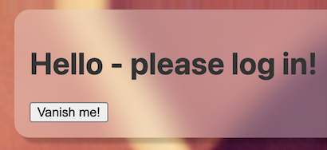

# `aside-keys`

The component helps add social login to one's web app.



><font color=red>tbd. replace with screenshot having login providers</font>

## Usage

><font color=red>tbd. about importing the component (once we publish)</font>

Within your app's HTML:

```
<body>
  ..
  <aside-keys options="google">
    <h1>Hello - please log in!</h1>
  </aside-keys>
  ..
</body>  
```

The component is created as a `position: fixed` entry that lives in the top right corner of the screen. [^1]

[^1]: This is the same corner as [Google One Tap for Web](https://developers.google.com/identity/one-tap/web) uses for login.

### Sign-in 

If the person is not logged in, the dialog appears. Once they log in, it slides away.

### Sign-out

><font color=red>tbd. Should provide programmatic API for signing out. Discuss implication to routes etc.</font>

## Attributes

### `options`

Login providers. Available choices:

|||
|---|---|
|`google`|<font color=red>tbd. discuss (which google, firebase?)</font>|

>tbd. callbacks etc.

