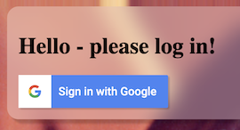

# aside-keys

<!-- packages/aside/README.md
- visible in npm registry
- for users; explains how to import and use the package
-->



Allows signing in with [Firebase authentication](https://firebase.google.com/products/auth).


A modern alternative to the traditional Firebase UI library - that's no longer needed. <font size="+3">🕺</font>

## Features

- Themable - your application gives the CSS
- For browsers with native ES module support
- Modern, light and only concerned with web
- Supports Firebase and Google Identity Platform

<!-- 
## Playground

tbd. place testing link in the GitHub description, once deployed
-->


## Requirements

A web project that [can consume](https://caniuse.com/es6-module) native ES modules. The project is not considering supporting legacy browsers.

<!-- whisper:
It shouldn't be hard to support also legacy browsers. Svelte does it. It's just not in the scope for the project, for additional testing involved etc. reasons.
-->

Firebase or [Google Identity Platform](https://cloud.google.com/identity-platform) project, initialized in your app with the following values:

- API key
- auth domain

See Google or Firebase documentation on how to create such a project. See `demo/index-glassy.html` on how to initialize Firebase JS SDK.

>Security note:
>
>While the auth values are not exactly secrets (people having access to your web site will be able to sniff them out), it is recommended by Google not to store them in public version control repos.


## Using in your project

```
$ npm install @akauppi/aside-keys
```

>WARNING: THE NAME OF THE EXPORTED ARTEFACT WILL LIKELY CHANGE.

In your browser code:

```
import { init } from "@akauppi/aside-keys"
```

This needs some ES resolver (eg. Vite; see the module's [GitHub repo](http://github.com/akauppi/aside-keys) for a sample) to resolve the node packages to browser JavaScript modules.

### HTML

The `aside-keys` web component handles the visual side of the authentication. It is visible when `init` has been called, and if there is not an active user signed in.

```
<aside-keys>
  <h1>Hello - please log in!</h1>
</aside-keys>
```

The HTML you place in the slot (between the `aside-keys` start and end tags) is completely up to you. You should somehow indicate what the panel is about.

<!-- WIP
The `display:none` seems to be needed so that the slotted text contents does not flash at load.[^1]

[^1]: Do contribute if you know a way that doesn't need such application side patching.
—->

### CSS

The component *does not style itself*. You provide the style using [CSS ::part](https://developer.mozilla.org/en-US/docs/Web/CSS/::part) (MDN Web Docs).

>CSS `::part` allows the user of a web component to provide themes for the component, but only to parts that the component has specifically exposed. This allows the dance between the component and its context to be done right, and simple.

`aside-keys` exposes the `frame` "part" for this purpose.

The looks of the above snapshot were made by:

<details>
  <summary>Sample CSS from [`index-glassy.html`](https://github.com/akauppi/aside-keys/blob/master/demo/index-glassy.html)</summary>
  
  ```
  aside-keys::part(frame) {
    background: rgba(255, 255, 255, 0.3);  /* semi-transparent background */
    backdrop-filter: blur(1em);
    -webkit-backdrop-filter: blur(1em);

    /* enable to get a thin border
    border-left: 1px solid rgba(190,190,190,0.6);
    border-bottom: 1px solid rgba(190,190,190,0.6);
    */
    border-radius: 1em 0 0 1em;
    box-shadow: 6px 6px 3px rgba(0, 0, 0, 0.2);

    margin-top: 10px;
  }

  @supports not ((backdrop-filter: blur(0)) or (-webkit-backdrop-filter: blur(0))) {
    aside-keys::part(frame) {
      background: rgba(255, 255, 255, 0.9);  /* more opaque */
    }
  }
  ```
</details> 


### JavaScript

The `aside-keys` component works as a singleton - it makes sense to have only one of them per web app.

Initialization is done by calling:

```
import { init } from '@akauppi/aside-keys'

init( firebaseApp );
```

That's all you need to do.

The call returns a `Promise` that you can listen to, to know when initialization has reached a known state.

Everything else - listening to user changes and signing out - is done using the [Firebase auth API](https://firebase.google.com/docs/reference/js/firebase.auth.Auth).

Bonus! Are you interested in sample code to bind the user notifications to the front end reactivity system. Here are samples for:

- [Svelte 3](bonus/svelte3.js)
- [Vue.js 3](bonus/vue3.js)

## Inside look 🔬

The visual aspect is completely separate from the code handling the sign in/out activities. If you sign in a user using other means than the component, the component should be fine with this. :)

### Visual & layout

Top right is a typical location for sign-in information, around 2021. Many web services show one's active profile there, so we adopted this corner. It's currently not customizable.

For mobile phone, sliding from below may be a better idea. Let's consider this if the component gets traction.

<!-- reminder
[Google One Tap for Web](https://developers.google.com/identity/one-tap/web) uses bottom of the screen.
-->

## References

- [Learn about using and managing API keys for Firebase](https://firebase.google.com/docs/projects/api-keys) (Firebase docs)
- Google Identity Platform: [Using API keys](https://cloud.google.com/docs/authentication/api-keys) (Google Cloud docs)
- [Styling in the Shadow DOM With CSS Shadow Parts](https://css-tricks.com/styling-in-the-shadow-dom-with-css-shadow-parts/) (blog, Oct 2020)
